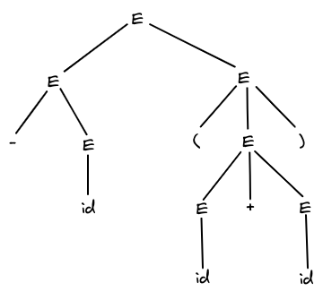

import ImageCenter from '@site/src/components/ImageCenter';

# Context-Free Grammars

## The Formal Definition of a Context-Free Grammar

一个 **[上下文无关文法 (CFG, Context-Free Grammar)](https://en.wikipedia.org/wiki/Context-free_grammar)** $G$ 是一个四元组 $(T, NT, S, P)$，其中：
- $T$：**终结符集 / 单词集 (Terminals / Terminal Symbols)**，就是词法分析中的 token，是语言 $L(G)$ 中的单词，终结符号是组成句子的基本单位。
- $NT$：**非终结符集 (Nonterminals / Variables)**，是语法上的变量，表示了语言 $L(G)$ 层次化的结构，出现在 $G$ 的产生式中。
- $S$：**开始符 (Start Symbol)**，单独从 $NT$ 中指定一个非终结符作为开始符，$S$ 所能生成的所有句子就是文法 $G$ 代表的语言 $L(G)$。按照惯例，开始符的产生式总是写在第一个。
- $P$：**产生集 / 规则集 (Productions / Rules)**，文法 $G$ 中所有产生式的集合，CFG 的产生式具有 $NT \rightarrow (T \cup NT)^+$ 的形式，也就是说，产生式将一个非终结符替换为一个符号串。

:::tip 巴科斯范式

上下文无关文法的传统表示是巴科斯范式 (BNF, Backus Normal Form)，又称为巴科斯-诺尔范式 (BNF, Backus-Naur Form)。
它是由美国著名计算机科学家 [John Backus](https://en.wikipedia.org/wiki/John_Backus)[^1] 和丹麦著名计算机科学家 [Peter Naur](https://en.wikipedia.org/wiki/Peter_Naur)[^2] 首先引入的用来描述计算机语言语法的符号集。

:::

:::note 算术表达式文法

$$
  \begin{aligned}
    E &\rightarrow E + T \ | \ E - T \ | \ T \\
    T &\rightarrow T * F \ | \ T / F \ | \ F \\
    F &\rightarrow ( \ E \ ) \ | \ \textbf{id}
  \end{aligned}
$$

其中，$E$ 代表 expression，$T$ 代表 term，$F$ 代表 factor，$\textbf{id}$ 代表 identifier。

:::

:::tip 文法的分类

美国著名语言学家、哲学家 [Noam Chomsky](https://en.wikipedia.org/wiki/Noam_Chomsky) 在 1956 年提出了 [Chomosky Hierarchy](https://en.wikipedia.org/wiki/Chomsky_hierarchy)，将形式语言分为四类：

<ImageCenter>

</ImageCenter>

| Grammar | Language | Automaton | Production Rules |
| ------- | -------- | --------- | ---------------- |
| Type 0 | Recursively Enumerable (Unrestricted) | Turing Machine | $\gamma \rightarrow \alpha$ (no constraints) |
| Type 1 | Context-Sensitive | Linear-Bounded Non-Deterministic Turing Machine | $\alpha A \beta \rightarrow \alpha \gamma \beta$ |
| Type 2 | Context-Free | Non-Deterministic Pushdown Automaton | $A \rightarrow \alpha$ |
| Type 3 | Regular | Finite State Automaton | $A \rightarrow a$   or $A \rightarrow aB$ |

符号的含义：
- $a$ = terminal
- $A, B$ = nonterminal
- $\alpha, \beta, \gamma$ = string of terminals and/or nonterminals
  - $\alpha, \beta$ maybe empty
  - $\gamma$ is never empty

从上下文有关文法的产生式规则中可以看出，**只有当非终结符 $A$ 在 $\alpha$ 和 $\beta$ 的中间时 (或者说在 $\alpha$ 和 $\beta$ 的上下文中)**，才可以将 $A$ 替换成非空的 $\gamma$。
而在上下文无关文法的产生式规则中，无论非终结符 $A$ 的上下文是什么，我们总是可以将 $A$ 替换成 $\alpha$。
这就是所谓的上下文有关与上下文无关。

对于正则文法的产生式规则，实际上表示的是，当有限自动机的输入为 $\alpha$ 时，它将从状态 $A$ 转移到状态 $B$。

对于无限制文法，超出了编译原理一般上研究的范畴，而且笔者对此了解不多，故不作解释，有兴趣的读者可以自行搜索或查阅相关资料。

在工程中，很多编程语言是上下文有关的，但为什么仍用 CFG 进行语法分析呢？
- CFG 可以完美地描述表达式和语句的递归语法。
- CSG 语法分析器效率低。
- 编程语言大部分结构是 CF 的，剩下 CS 的部分可以在语义分析阶段进行分析。
  - 比如 if statement, declarations 等是 CF 的。
  - 比如 define before use, matching formal parameters 等问题是 CS 的。

:::

## Derivations

将产生式看成是重写规则，产生式实际上在做的就是符号串的替换。

一个 **句子 (Sentence)** 指的是一个可以由文法 $G$ 生成的符号串，**其中所有的符号都是终结符**。
一个文法 $G$ 生成的 **语言 (Language)** $L(G)$ 是它所有句子组成的集合。
如果两个文法生成的语言相同，这两个文法就被称为是等价的。

一个 **推导 (Derivation)** 指的是一个应用产生式规则的序列，以文法 $G$ 的开始符作为开始，以 $L(G)$ 中的一个句子作为结束。
我们用 $\alpha \Rightarrow \beta$ 表示符号串 $\alpha$ **推导出** 符号串 $\beta$ **($\alpha$ derives $\beta$)**。
- $\alpha \xRightarrow{} \beta$: Derives in one step.
- $\alpha \xRightarrow{*} \beta$: Derives in zero or more steps. Especially, $\alpha \xRightarrow{*} \alpha$ (zero step).
- $\alpha \xRightarrow{+} \beta$: Derives in one or more steps.

如果 $S \xRightarrow{*} \alpha$，其中 $S$ 是文法 $G$ 的开始符号，则称 $\alpha$ 是 $G$ 的一个 **句型 (Sentential Form)**。

:::info Note

一个句型<u>可能既包含非终结符，又包含终结符，也可能是空串</u>。

特别地，一个句子也是一个句型，<u>句子是不包含非终结符的句型</u>。

:::

在推导中，我们可以在其中的每一步选择某个非终结符按照产生式进行替换，但这毕竟属于人工操作，而语法分析器需要自动化地进行解析，它会以固定的方式选择被替换的非终结符。
- **最左推导 (Leftmost Derivation)**：每步总是选择句型最左边的非终结符进行替换。用 $\alpha \xRightarrow[lm]{} \beta$ 表示。
- **最右推导 (Rightmost Derivation)**：每步总是选择句型最右边的非终结符进行替换。用 $\alpha \xRightarrow[rm]{} \beta$ 表示。

:::note Example

考虑下面的文法：
$$
  E \rightarrow E \ + \ E \ | \ E \ * \ E \ | \ -E \ | \ ( \ E \ ) \ | \ \textbf{id}
$$
和串：
$$
  - \textbf{id} * ( \textbf{id} + \textbf{id})
$$

一个最左推导为：
$$
  \begin{aligned}
  E &\Rightarrow E * E \Rightarrow -E * E \Rightarrow -\textbf{id} * E \Rightarrow -\textbf{id} * (E) \\
    &\Rightarrow -\textbf{id} * (E + E) \Rightarrow -\textbf{id} * (\textbf{id} + E) \Rightarrow -\textbf{id} * (\textbf{id} + \textbf{id})
  \end{aligned}
$$

一个最右推导为：
$$
  \begin{aligned}
  E &\Rightarrow E * E \Rightarrow E * (E) \Rightarrow E * (E + E) \Rightarrow E * (E + \textbf{id}) \\
    &\Rightarrow E * (\textbf{id} + \textbf{id}) \Rightarrow E * (\textbf{id} + \textbf{id}) \Rightarrow -\textbf{id} * (\textbf{id} + \textbf{id})
  \end{aligned}
$$

:::

我们在上面的例子中将 $\xRightarrow[lm]{}$ 和 $\xRightarrow[rm]{}$ 简写成 $\Rightarrow$。
为了强调 $\alpha$ 经过一个最左推导 (或最右推导) 得到 $\beta$，我们写成 $\alpha \xRightarrow[lm]{*} \beta$ (或 $\alpha \xRightarrow[rm]{*} \beta$)。

对于文法 $G$，它的开始符号是 $S$，如果有 $S \xRightarrow[lm]{*} \alpha$ (或 $S \xRightarrow[rm]{*} \alpha$)，
我们称 $\alpha$ 是文法 $G$ 的一个 **最左句型 (Left-Sentential Form) (或最右句型, Right-Sentential Form)**。

最右推导有时也称为 **规范推导 (Canonical Derivation)**，在后面我们会看到，最右推导与自底向上语法分析相关。
最左推导则对应于自顶向下构造语法分析树的过程。

## Parse Trees

一个 **语法分析树 (Parse Tree)** 是一个推导的图形表示，它过滤掉了推导的顺序信息。
- 每个 **内部节点 (interior node)** 表示一个产生式的应用。
- **叶子节点 (leaves)** 既可以是非终结符，也可以是终结符。
  - 将语法分析树的叶子从左到右排列就可以得到一个句型，称为这棵树的 **产出 (yield)** 或 **边缘 (frontier)**。

在上面的例子中，$-\textbf{id} * (\textbf{id} + \textbf{id})$ 给出的最左推导和最右推导的语法分析树都是：

<ImageCenter>

</ImageCenter>

## Ambiguity and Its Elimination

## Left Recursion and Its Elimination

## Left Factoring

[^1]: John Backus 领导发明设计了 FORTRAN 语言，被称为 FORTRAN 语言之父，他提出了 BNF，发明了函数式编程的概念及实践该概念的 FP 语言，为 1977 年图灵奖得主。
[^2]: Peter Naur 协作开发了 BNF，为 2005 年图灵奖得主，也是目前唯一一位丹麦籍的得主。
