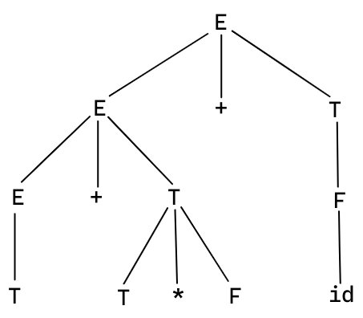

import ImageCenter from '@site/src/components/ImageCenter';
import Highlight from '@site/src/components/Highlight';

# Bottom-Up Parsing

**自底向上语法分析 (Bottom-Up Parsing)** 从叶子开始，通过不断向上归约构造语法树。自底向上语法分析等价于找到输入符号串的一个最左归约。

## Reductions

**归约 (Reduction)** 是<u>推导的逆过程</u>。

对于文法 $G$，如果有推导 $\alpha \xRightarrow{*} \beta$，则称 $\beta$ 可归约为 $\alpha$，或者 $\alpha$ 是 $\beta$ 的一个归约。
特别的，如果有 $\alpha \Rightarrow \beta$，则称 $\beta$ 可直接归约为 $\alpha$，或者 $\alpha$ 是 $\beta$ 的一个 **直接归约 (Direct Reduction)**。

- **最左归约 (Leftmost Reduction)**：最右推导的逆过程，也称为 **规范归约 (Canonical Reduction)**。
- **最右归约 (Rightmost Reduction)**：最左推导的逆过程。

:::note Example


:::

## Handle

对于文法 $G$，如果有 $S \xRightarrow[rm]{*} \alpha$ (其中 $S$ 是 $G$ 的开始符号)，则称 $\alpha$ 是 $G$ 的一个 **最右句型 (Right-Sentential Form)**。对于 **最左句型 (Left-Sentential Form)**，我们有完全类似的定义。
前面说过，最右推导通常被称为规范推导，而最右句型也称 **规范句型 (Canonical Sentential Form)**。

对于文法 $G$，如果有 $S \xRightarrow{*} xAy \xRightarrow{+} x \alpha y$，则称 $\alpha$ 是句型 $xAy$ 关于 $A$ 的 **短语 (Phrase)**。
特别的，如果 $S \xRightarrow{*} xAy \Rightarrow x \alpha y$，则称 $\alpha$ 是 **简单短语/直接短语 (Simple Phrase)**。

一个句型的 <u>最左简单短语 (leftmost simple phrase)</u> 被称为这个句型的 **句柄 (Handle)**。

:::note Note

如果仅仅有 $A \xRightarrow{+} \alpha$，并不能说明 $\alpha$ 就是句型 $xAy$ 关于 $A$ 的一个短语，还必须要有 $S \xRightarrow{*} xAy$。

:::

:::tip From the View of Parse Tree

从语法分析树的角度来说：
- 一个句型的语法树中任一子树的叶子所组成的符号串都是该句型的短语。
  > 子树就是以内部节点为根节点的树。内部节点是非叶子节点。
- 一个句型的语法树中 <u>只有一层分支</u> 的子树的叶子所组成的符号串都是该句型的简单短语。
  - 句柄就是语法树最左边的简单短语。

考虑表达式文法：
$$
  \begin{aligned}
    E &\rightarrow E + T \ | \ E - T \ | \ T \\
    T &\rightarrow T * F \ | \ T / F \ | \ F \\
    F &\rightarrow ( \ E \ ) \ | \ \textbf{id}
  \end{aligned}
$$
以及下面的句型：
$$
  T + T * F + id
$$

它的语法树为：
<ImageCenter scale="50%">



</ImageCenter>

它的短语有：
- $T + T * F + id$
- $T + T * F$
- $T$ (句柄、简单短语)
- $T * F$ (简单短语)
- $\textbf{id}$ (简单短语)

:::

:::question Why Handle?


:::

## Shift-Reduce Parsing

句柄总是会出现在栈顶，而不会在栈的内部。

| Stack | Input | Action |
| ----- | ----- | ------ |
| $\$$ | $\text{i}_1 * \text{i}_2 + \text{i}_3 \ \$$ | shift |
| $\$\ \text{i}_1$ | $* \text{i}_2 + \text{i}_3 \ \$$ | reduce by $F \rightarrow \text{i}_1$ |
| $\$\ F$ | $* \text{i}_2 + \text{i}_3 \ \$$ | reduce by $T \rightarrow F$ |
| $\$\ T$ | $* \text{i}_2 + \text{i}_3 \ \$$ | shift |
| $\$\ T *$ | $\text{i}_2 + \text{i}_3 \ \$$ | shift |
| $\$\ T * \text{i}_2$ | $+ \text{i}_3 \ \$$ | reduce by $F \rightarrow \text{i}_2$ |
| $\$\ T * F$ | $+ \text{i}_3 \ \$$ | reduce by $T \rightarrow T * F$ |
| $\$\ T$ | $+ \text{i}_3 \ \$$ | reduce by $E \rightarrow T$ |
| $\$\ E$ | $+ \text{i}_3 \ \$$ | shift |
| $\$\ E +$ | $\text{i}_3 \ \$$ | shift |
| $\$\ E + \text{i}_3$ | $\$$ | reduce by $F \rightarrow \text{i}_3$ |
| $\$\ E + F$ | $\$$ | reduce by $T \rightarrow F$ |
| $\$\ E + T$ | $\$$ | reduce by $E \rightarrow E + T$ |
| $\$\ E$ | $\$$ | accept |

- Shift/Reduce Conflict
- Reduce/Reduce Conflict

## LR Parsers

LR(k): Parsers of LR family.
- **L**: Scan input from <Highlight color="#3578e5">l</Highlight>eft to right.
- **R**: Construct a <Highlight color="#3578e5">r</Highlight>ightmost derivation in reverse.
- **k**: Use <Highlight color="#3578e5">k</Highlight> input symbols of lookahead to make decisions.
  - k = 0 or 1 are of particular interests, k is assumed to be 1 when omitted.

:::question Why LR Parsers?

LR(k) VS LL(k):
- LR(k) is more powerful than LL(k).
  - LR parsers can be constructed to recognize virtually all programming-language constructs for which context-free grammars can be written. Non- LR context-free grammars exist, but these can generally be avoided for typical programming-language constructs.
  - The class of grammars that can be parsed using LR methods is a proper superset (真超集) of the class of grammars that can be parsed with predictive or LL methods. LL(k) $\subset$ LR(k).
  - Eliminating left recursion or left factoring is not needed.
- LR(k) is as efficient as LL(k).
  - Linear in time and space to length of input, same as LL(k).
- LR(k) is as convenient as LL(k).
  - Can generate automatically from grammar (YACC, Bison).

:::

:::info An Ambiguous Grammar Can Never Be LR

考虑下面的 dangling-else 文法：
$$
  S \rightarrow i E t S \mid i E t S e S
$$

如果我们有一个 shift-reduce parser 正处在下面的情况：

| Stack | Input |
| ----- | ----- |
| $\$ \ \cdots i E t S$ | $e \cdots \ \$$ |

我们无法确定 $iEtS$ 是否为一句柄，无论在它之下的栈内容是什么。此时，有两种可能的选择：
- 将 $iEtS$ 归约为 $S$。
- 将 $e$ 移进，期待下一个 $S$，来完成 $iEtSeS$。

但我们不知道应该选择哪一个动作。因此，这个文法不是 LR(1) 的。

需要指出的是，LR 分析技术可作修改，来适用于一些二义性文法。
比如，上面的 dangling-else 文法也可用 LR 进行分析，我们可以规定当出现上面的情形时，将 $e$ 移进，而不是把 $iCtS$ 归约为 $S$，这样符合程序语言的一般规定。

:::

我们接下来要讨论的 LR 分析本质上都是寻找给定符号串的规范归约。
规范归约的关键问题是确定和寻找句柄。

### LR(0)

**活前缀/可行前缀 (Viable Prefix)** 指的是规范句型的一个前缀，这种前缀不含句柄之后的任何符号。

形式上，给定一个文法 $G$，如果存在一个具有下面形式的最右推导
$$
  S \xRightarrow[rm]{*} \alpha A \omega \xRightarrow[rm]{} \alpha \beta_1 \beta_2 \omega
$$
我们就称 $\gamma = (NT \cup T)^{*}$ 是 $G$ 的一个活前缀，且 $\gamma = \alpha \beta_1$。并称 $A \rightarrow \beta_1 \cdot \beta_2$ 是活前缀 $\gamma$ 的 **有效项 (Valid Item)**。一个活前缀一定有有效项，一个有效项可能与多个活前缀相关联。

之所以称为活前缀，是因为在右边添加一些终结符之后，就可以使它成为一个规范句型。
在 shift-reduce parser 中，栈中符号串始终是最右句型的一个活前缀，它最多包含但不会越过当前句型的句柄 (当前句型指的是，栈中符号串和输入符号串构成的句型)。

:::info

在 LR 分析过程中的任何时候，<u>栈里的符号串 (自底向上) 应该构成活前缀</u>，如果把输入串的剩余部分加在后边应成为规范句型。

:::

:::tip

幸运的是，一个上下文无关文法的活前缀构成了一个正规语言，这说明我们可以用 DFA 来识别所有的活前缀。

:::

LR 分析通过维护一系列状态，来跟踪当前的分析阶段，进而决定是移进还是归约。
一个状态实际上代表一个项目集。

文法 $G$ 的一个 **项目 (Item)** 是 $G$ 的一个产生式，产生式右部的某个位置有一个点 (dot)。项目通常也被称为 LR(0) 项目。

比如说，产生式 $A \rightarrow XYZ$ 可形成 4 个项目：

$$
  \begin{aligned}
    A &\rightarrow \cdot XYZ  \\
    A &\rightarrow X \cdot YZ \\
    A &\rightarrow XY \cdot Z \\
    A &\rightarrow XYZ \cdot  \\
  \end{aligned}
$$

:::tip

直观上说，一个项目指明了在分析过程中的某一时刻我们看到产生式的多大一部分。
例如，$A \rightarrow \cdot XYZ$ 意味着，我们希望从后面的输入串中看到可以由 $XYZ$ 推导出的符号串。
$A \rightarrow X \cdot YZ$ 意味着，我们已经从输入串中看到能由 $X$ 推出的符号串，接下来希望看到可以由 $YZ$ 推出的符号串。$A \rightarrow XYZ \cdot$ 意味着，我们已经看到了产生式体 $XYZ$，或许应该将 $XYZ$ 归约到 $A$。

:::tip

对于文法 $G$，其开始符号为 $S$，通过添加一个产生式 $S^{\prime} \rightarrow S$，并令开始符号为 $S^{\prime}$，得到的文法 $G^{\prime}$ 称为 $G$ 的 **增广文法 (Augmented Grammar)** $G^{\prime}$。

:::tip

这样做的目的是，可以使接受状态易于识别，确保了 parse table 中只有一个 accept 表项，只有这个新添加的产生式可以告知分析器什么时候应该停止解析，宣布接受输入符号串。

:::

对于文法 $G$，如果 $I$ 一个项目集，**项目集的闭包 (Closure of Item Sets)** $\text{CLOSURE}(I)$ 由下面的规则进行构造：
1. 初始时，$I$ 的任何项目都属于 $\text{CLOSURE}(I)$。
2. 若 $A \rightarrow \alpha \cdot B \beta$ 属于 $I$，则对于任何关于 $B$ 的产生式 $B \rightarrow \gamma$，项目 $B \rightarrow \cdot \gamma$ 也属于 $I$。重复应用这条规则，直到没有任何新的项目可以添加到 $\text{CLOSURE}(I)$。

:::tip

直观上说，$A \rightarrow \alpha \cdot B \beta$ 属于 $\text{CLOSURE}(I)$ 意味着，在分析过程中的某个时刻，我们期望接下来看到的是可以由 $B \beta$ 推出的符号串。这个符号串一定会有一个由 $B$ 推出的前缀，因此对于所有的 $B$-productions $B \rightarrow \gamma$，也将 $B \rightarrow \cdot \gamma$ 加入到 $\text{CLOSURE}(I)$。

:::

:::note Example

考虑增广算术表达式文法：
$$
  \begin{aligned}
    E^{\prime} &\rightarrow E \\
    E &\rightarrow E + T \mid E - T \mid T \\
    T &\rightarrow T * F \mid T / F \mid F \\
    F &\rightarrow ( \ E \ ) \mid \textbf{id}
  \end{aligned}
$$

如果 $I = \lbrace E^{\prime} \rightarrow E \rbrace$，则 $\text{CLOSURE}(I)$ 包含：
$$
  \begin{aligned}
    E^{\prime} &\rightarrow \cdot E \\
    E &\rightarrow \cdot E + T \\
    E &\rightarrow \cdot E - T \\
    E &\rightarrow \cdot T \\
    T &\rightarrow \cdot T * F \\
    T &\rightarrow \cdot T / F \\
    T &\rightarrow \cdot F \\
    F &\rightarrow \cdot \lparen E \rparen \\
    F &\rightarrow \cdot \textbf{id}
  \end{aligned}
$$

:::

状态转换函数表示为 $\text{GOTO}[I, X]$，其中 $I$ 代表一个项目集，$X$ 是一个文法符号。
$$
  \text{GOTO}[I, X] = \text{CLOSURE}(J)
$$
其中 $J = \lbrace A \rightarrow \alpha X \cdot \beta \mid A \rightarrow \alpha \cdot X \beta \in I \rbrace$。

:::tip

直观上说，$\text{GOTO}$ 函数是用来定义 LR(0) 自动机的状态转换的，自动机的状态代表项目集，$\text{GOTO}(I, X)$ 确定了在当前状态为 $I$，输入为 $X$ 时，应跳转到什么状态。

:::

:::note Example

对于上面的增广算术表达式文法，设 $I = \lbrace E^{\prime} \rightarrow E \cdot, \ E \rightarrow E \cdot + T \rbrace$，则 $\text{GOTO}(I, +)$ 包含：
$$
  \begin{aligned}
    E &\rightarrow E + \cdot T \\
    T &\rightarrow \cdot T * F \\
    T &\rightarrow \cdot T / F \\
    T &\rightarrow \cdot F \\
    F &\rightarrow \cdot \lparen E \rparen \\
    F &\rightarrow \cdot \textbf{id}
  \end{aligned}
$$

:::

接下来，给定文法 $G$ 的增广文法 $G^{\prime}$，我们就可以利用 $\text{CLOSURE}$ 和 $\text{GOTO}$ 来构造 **LR(0) 项目集规范族 (Canonical Collection of Sets of LR(0) Items)** $C$。

```algorithm Construction of Canonical Collection of Sets of LR(0) Items
ItemSets(G')  // G' is the augmented grammar
{
  C = { CLOSURE({S' -> ·S}) };  // C is the canonical collection of sets of LR(0) items
  repeat:
    for (each set of items I in C):
      for (each grammar symbol X):
        if (GOTO(I, X) is not empty and not in C)
          add GOTO(I, X) to C;
  until: no new sets of items are added to C on a round;
}
```

LR(0) 自动机 (LR(0) Automaton)
- 自动机的状态 $j$ 对应 LR(0) 规范族 $C$ 中的项目集 $I_j$。我们说 state $j$ 就代表 $I_j$。
- 自动机的状态转换由 $\text{GOTO}$ 函数给出。$\text{GOTO}(I_j, X) = I_k$ 表示状态 $j$ 到状态 $k$ 有一条 $X$ 边。
- 自动机的起始状态是 $\text{CLOSURE}({S^{\prime} \rightarrow \cdot S})$，所有的状态都是接受状态。

:::question What Is The Use Of LR(0) Automaton?

OK，兄弟们，太抽象辣！

构造 LR(0) 自动机的过程和 NFA 转换为 DFA 的过程非常相似（实际上做的就是将 NFA 转换为 DFA）。

<u>LR(0) 自动机的作用是用来识别文法的全部活前缀</u>。

:::

:::note Example

$$
  \begin{aligned}
    S &\rightarrow AA \\
    A &\rightarrow aA \mid b \\
  \end{aligned}
$$

:::

LR(0) Conflicts:
- reduce/reduce conflict: Any state has two reduce items.
- shift/reduce conflict: Any state has a shift item and a reduce item

TODO:
- Model of a LR Parser (Put an image there :-)
- Structure of the LR Parsing Table
  - ACTION and GOTO
- LR Parsing Algorithm

### SLR(1)

给定文法 $G$，对于增广文法 $G^{\prime}$，$G^{\prime}$ 的 SLR 预测分析表的构造方法：
1. 构造 LR(0) 项集规范族 $C = \lbrace I_0, I_1, \cdots, I_n \rbrace$。
2. 状态 $i$ 对应的 $\text{ACTION}$ 由下面的规则确定：
   - 若 $[A \rightarrow \alpha \cdot a \beta] \in I_i$ 且 $\text{GOTO}(I_i, a) = I_j$ (其中 $a$ 必须是终结符），则 $\text{ACTION}(i, a) := shift \ j$。
   - 若 $[A \rightarrow \alpha \cdot]\in I_i$，则 $\forall a \in \text{FOLLOW}(A), \text{ACTION}(i, a) := reduce \ A \rightarrow \alpha$。
   - 若 $[S^{\prime} \rightarrow S] \in I_i$，则 $\text{ACTION}(i, \$) := accept$。
   - 对于剩下的 $a$，$\text{ACTION}(i, a) := error$。

   如果 $\text{ACTION}(i, a)$ 产生冲突 (即有两个或两个以上的可选动作)，那么我们就说文法 $G$ 就不是 SLR(1) 的。

3. 状态 $i$ 对应的 $\text{GOTO}$ 由下面的规则确定：
   - 若 $\text{GOTO}(I_i, A) = I_j$ (其中 $A$ 必须是非终结符)，则 $\text{GOTO}(i, A) = j$。

### LR(1)

### LALR(1)
